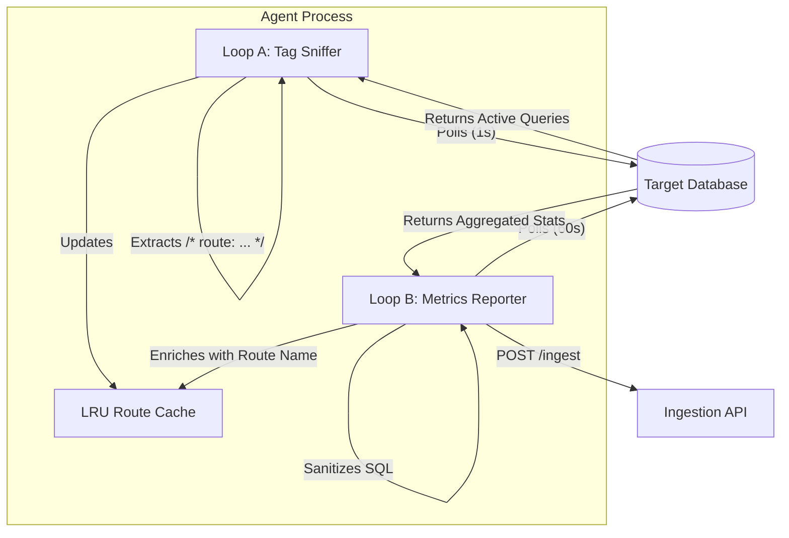

# System Architecture

This document describes the technical architecture, data flow, and API schema for the DB Latency Tracker Agent.

## Tech Stack

The agent is built as a lightweight, containerized Node.js application.

*   **Runtime:** Node.js v20 (Alpine Linux for minimal Docker image size).
*   **Language:** TypeScript 5.2.
*   **Database Drivers:**
    *   `pg`: PostgreSQL client.
    *   `mysql2`: MySQL client.
*   **HTTP Client:** `axios` with `axios-retry` for resilient API communication.
*   **Testing:** Jest.
*   **Frontend:** N/A (Headless agent).

## System Components

1.  **DB Latency Tracker Agent:** The core service running in a Docker container.
2.  **Target Database:** The database instance being monitored (PostgreSQL or MySQL).
    *   Requires `pg_stat_statements` (Postgres) or `performance_schema` (MySQL).
3.  **Ingestion API:** The remote endpoint receiving the aggregated latency metrics.

## Data Flow

The agent operates on a dual-loop concurrency model using recursive `setTimeout` to ensure serial execution within each loop without blocking the other.



### 1. Loop A: Tag Sniffer
*   **Frequency:** High (every 1 second).
*   **Purpose:** Captures transient SQL queries currently executing to extract application-level tags (e.g., `/* route: /api/login */`).
*   **Storage:** Stores the mapping of `Query Hash -> Route Name` in an in-memory LRU cache.

### 2. Loop B: Metrics Reporter
*   **Frequency:** Low (configurable, default 60 seconds).
*   **Purpose:** Aggregates performance metrics (latency, calls, rows) from the database's internal statistics views.
*   **Processing:**
    *   Correlates queries with route names using the LRU Cache.
    *   Sanitizes SQL text (removes PII).
    *   Sends a JSON payload to the Ingestion API.

## API Schema

The agent sends a `POST` request to the configured ingestion endpoint (`${API_URL}/ingest`).

**Request Headers:**
*   `Content-Type`: `application/json`
*   `Authorization`: `Bearer <INGESTION_TOKEN>`

**JSON Payload:**

```json
{
  "timestamp": "2023-10-27T10:00:00.000Z",
  "agent_version": "1.0.0",
  "db_type": "postgres",
  "metrics": [
    {
      "query_hash": "82934234234",
      "query_text": "SELECT * FROM users WHERE id = ?",
      "route_name": "/api/users/:id",
      "avg_latency": 12.5,
      "call_count": 150,
      "rows_processed": 150
    },
    {
      "query_hash": "12312312312",
      "query_text": "UPDATE items SET price = ? WHERE id = ?",
      "route_name": null,
      "avg_latency": 45.2,
      "call_count": 5,
      "rows_processed": 5
    }
  ]
}
```

*   `route_name`: Can be `null` if no tag was captured for that query hash.
*   `query_text`: Sanitized SQL (quoted strings and numbers replaced with `?`).
